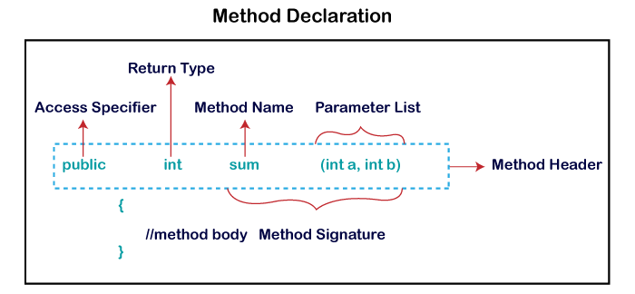

# JAVA Datatypes, Collections, Syntax For DSA

### References

- https://www.javatpoint.com/java-tutorial
- https://www.w3schools.com/java/default.asp

### OOPs (Object-Oriented Programming System)

Object means a real-world entity such as a pen, chair, table, computer, watch, etc. Object-Oriented Programming is a methodology or paradigm to design a program using classes and objects. It simplifies software development and maintenance by providing some concepts:

- [Object](https://www.javatpoint.com/object-and-class-in-java)
- [Class](https://www.javatpoint.com/object-and-class-in-java)
- [Inheritance](https://www.javatpoint.com/inheritance-in-java)
- [Polymorphism](https://www.javatpoint.com/runtime-polymorphism-in-java)
- [Abstraction](https://www.javatpoint.com/abstract-class-in-java)
- [Encapsulation](https://www.javatpoint.com/encapsulation)

### Methods



- Non-Static Method:
  Non-Static Methods are called with "this" or used an object of class in main method.

- Java does not support “directly” nested methods. Many functional programming languages support method within method.

Method 1 (Using anonymous subclasses): https://www.geeksforgeeks.org/anonymous-inner-class-java/

Method 2 (Using local classes): Class inside class (https://www.geeksforgeeks.org/method-within-method-in-java/)

Method 3 (Using a lambda expression): https://www.geeksforgeeks.org/lambda-expressions-java-8/

### Main Function

In Java, the public static void main(String[] args) method is the entry point for any standalone application. This is the method that the Java Virtual Machine (JVM) calls to start the execution of a program. However, a Java class does not require a main method to exist; it is only required if you want to execute the class as a standalone application.
Scenarios Where a Java Class Can Be Used Without a Main Method:

- As a Library: A Java class can be part of a library (a JAR file) that provides functionality to other classes or applications.
- Unit Testing: You can use a Java class in a testing framework like JUnit without a main method.
- Web Applications: In Java web applications (using servlets, JSP, etc.), classes do not have a main method. The application server (like Tomcat, Jetty, etc.) handles the execution and lifecycle of the web components.
- Java EE Applications: The application server manages the lifecycle of these components.
- Applets: Although largely obsolete, Java applets run in a web browser and do not use the main method. Instead, they use init, start, stop, and destroy methods.
- JavaFX Applications: Application class and overriding the start method. While a main method is often included to launch the JavaFX application, it can be omitted if the javafx.application.Application.launch() method is called directly by the JavaFX runtime.

### Control Statements

- if/else if/else:

```
if(condition 1) {
statement 1; //executes when condition 1 is true
}
else if(condition 2) {
statement 2; //executes when condition 2 is true
}
else {
statement 2; //executes when all the conditions are false
}
```

- switch:

```
switch(expression){
case value1:
 //code to be executed;
 break;  //optional
case value2:
 //code to be executed;
 break;  //optional
......

default:
  code to be executed if all cases are not matched;
}
```

- for loop:

```
for(initialization; condition; increment/decrement){
//statement or code to be executed
}

for(int i=1;i<=10;i++){
    System.out.println(i);
}
```

- for each:

```
for(data_type variable : array_name){
//code to be executed
}
```

- labelled for loop:
  We can have a name of each Java for loop. To do so, we use label before the for loop. It is useful while using the nested for loop as we can break/continue specific for loop.

```
public class LabeledForExample {
public static void main(String[] args) {
    //Using Label for outer and for loop
    aa:
        for(int i=1;i<=3;i++){
            bb:
                for(int j=1;j<=3;j++){
                    if(i==2&&j==2){
                        break aa;
                    }
                    System.out.println(i+" "+j);
                }
        }
}
}
```

- infinitive for loop:

```
for(;;){
//code to be executed
}
```

- while loop:

```
while (condition){
//code to be executed
I ncrement / decrement statement
}
```

- break: It breaks inner loop only if you use break statement inside the inner loop.

```
 for(int i=1;i<=10;i++){
        if(i==5){
            //breaking the loop
            break;
        }
        System.out.println(i);
    }
```

- continue: The Java continue statement is used to continue the loop. It continues the current flow of the program and skips the remaining code at the specified condition. In case of an inner loop, it continues the inner loop only.

```
//for loop
    for(int i=1;i<=10;i++){
        if(i==5){
            //using continue statement
            continue;//it will skip the rest statement
        }
        System.out.println(i);
    }
```

### Recursion

Recursion in Java works similarly to recursion in other programming languages. It involves a method calling itself to solve a problem

```
// Recursive method to calculate factorial
    public static int factorial(int n) {
        // Base case
        if (n <= 1) {
            return 1;
        }
        // Recursive case
        return n * factorial(n - 1);
    }
```

Recursion Tips

- Base Case: Always ensure there is a base case to prevent infinite recursion.
- Recursive Case: Ensure the recursive call progresses towards the base case.
- Stack Overflow: Be aware of stack overflow errors for deep recursion, as Java has a limit on the stack size.
- Efficiency: Recursive solutions can be elegant but might not always be the most efficient. For instance, the recursive Fibonacci example has exponential time complexity, which can be optimized using memoization or iterative approaches.

### Data Structures

Primitive data types - includes byte, short, int, long, float, double, boolean and char
Non-primitive data types - such as String, Arrays and Classes

```
int myNum = 5;               // Integer (whole number)
float myFloatNum = 5.99f;    // Floating point number
char myLetter = 'D';         // Character
boolean myBool = true;       // Boolean
String myText = "Hello";     // String
```

#### Integer:

Integer class is a wrapper class for the primitive type int which contains several methods to effectively deal with an int value like converting it to a string representation, and vice-versa.

- toString():

```
Integer obj3 = new Integer(10);

    //It will return a string representation
    String stringvalue3 = obj3.toString();
```

- valueOf():

```
Integer obj = new Integer(8);

        String str = "-6156";
        // It will return  a Integer instance
        // representing the specified string
        System.out.println("Output Value = " +
                            obj.valueOf(str));

 // Base = 2
        Integer val1 = Integer.valueOf("1010", 8);
        System.out.println(val1);

  // Base = 16
        Integer val2 = Integer.valueOf("1011", 16);
        System.out.println(val2);

```

- parseInt():

```
  int decimalExample = Integer.parseInt("20");
  int signedPositiveExample = Integer.parseInt("+20");
  int signedNegativeExample = Integer.parseInt("-20");
```

- intValue():

```
    // Creating object of Integer class inside main()
    Integer intobject = new Integer(68);

    // Returns the value of this Integer as an int
    int i = intobject.intValue();
```

- byteValue(), shortValue(), floatValue(), doubleValue()
- compare(), compareTo()

```
 int x = 30;
  int y = 30;

  // as 30 equals 30, Output will be zero
  System.out.println(Integer.compare(x, y));

   / as 10 less than 20, Output will be a value less than zero
  System.out.println(x.compareTo(y));
```

#### String:

```
String greeting = "Hello";
for length: txt.length()

System.out.println(txt.toUpperCase());   // Outputs "HELLO WORLD"
System.out.println(txt.toLowerCase());   // Outputs "hello world"

String txt = "Please locate where 'locate' occurs!";
System.out.println(txt.indexOf("locate")); // Outputs 7

System.out.println(firstName + " " + lastName); //concatination
System.out.println(firstName.concat(lastName)); // concat to firstname

String myStr = "Hello";
char result = myStr.charAt(0);

String myStr1 = "Hello";
String myStr2 = "Hello";
System.out.println(myStr1.compareTo(myStr2)); // Returns 0 because they are equal

String myStr = "Hello";
System.out.println(myStr.contains("Hel"));   // true

String myStr1 = "Hello";
String myStr2 = "Hello";
String myStr3 = "Another String";
System.out.println(myStr1.equals(myStr2)); // Returns true because they are equal

String myStr = "Hello planet earth, you are a great planet.";
System.out.println(myStr.indexOf("planet"));

String myStr2 = "";
System.out.println(myStr1.isEmpty());

String fruits = String.join(" ", "Orange", "Apple", "Mango");

String myStr = "Hello";
System.out.println(myStr.replace('l', 'p'));

String myStr = "Split a string by spaces, and also punctuation.";
String regex = "[,\\.\\s]";
String[] myArray = myStr.split(regex);

System.out.println(myStr.toString());
```

#### Array:

```
String[] cars = {"Volvo", "BMW", "Ford", "Mazda"};
int[] myNum = {10, 20, 30, 40};

System.out.println(cars[0]);

cars[0] = "Opel"; // change array element

System.out.println(cars.length);
// Outputs 4

int[][] myNumbers = { {1, 2, 3, 4}, {5, 6, 7} }; //Multidimensional Arrays
System.out.println(myNumbers[1][2]);

String[] cars = {"Volvo", "BMW", "Tesla"};
String[] cars2 = {"Volvo", "BMW", "Tesla"};

System.out.println(Arrays.compare(cars, cars2));
//return 0 if unequal,
//Returns a negative integer if the array1 is less than array2 lexicographically
//Returns a positive integer if array1 is greater than array2 lexicographically.

 // copying array org to copy
int[] copy = Arrays.copyOf(org, 5);

Arrays.sort(cars); //sort ascending

System.out.println(Arrays.equals(cars, cars2)); //return true/false

```

## Collections Framework

References:

- https://ioflood.com/blog/java-data-structures/

- https://leetcode.com/discuss/study-guide/1170715/java-data-structure-mostly-used-syntax

- https://www.interviewbit.com/java-collections-interview-questions/#:~:text=methods%20in%20it.-,3.%20Explain%20the%20hierarchy%20of%20the%20Collection%20framework%20in%20Java.,-The%20entire%20collection

- https://medium.com/edureka/data-structures-algorithms-in-java-d27e915db1c5

### List Interface

- ArrayList<E>: Provides a resizable array, ideal for dynamic arrays where elements can be added or removed.

```
List<Integer> arrayList = new ArrayList<>();
ArrayList<String> cars = new ArrayList<String>(); // Create an ArrayList object

cars.add("Mazda");

cars.add(0, "Mazda"); // Insert element at the beginning of the list (0)

cars.get(0);
cars.set(0, "Opel");

cars.remove(0);

cars.clear();

cars.size();

<!-- for each in ArrayList -->
for (String i : cars) {
      System.out.println(i);
}

Collections.sort(cars);  // Sort cars
```

- LinkedList<E>: Implements a doubly-linked list, useful for scenarios where frequent insertion and deletion of elements are required.

```
List<Integer> linkedList = new LinkedList<>();
LinkedList<String> cars = new LinkedList<String>();
cars.add("Volvo");

LinkedList<String> brands = new LinkedList<String>();
    brands.add("Microsoft");
brands.addAll(cars); // The addAll() method adds all of the items from a collection to the list.

cars.addFirst("Mazda"); // Use addFirst() to add the item to the beginning

cars.addLast("Mazda"); // Use addFirst() to add the item to the last

cars2.set(0, "Toyota"); //set a specific item with index

cars.clear();

cars.forEach( (car) -> { System.out.println(car); } );

getFirst()	//Returns the first item in the list
System.out.println(cars.get(0)); //specific position

System.out.println(cars.getLast());

System.out.println(cars.indexOf("Ford"));

System.out.println(cars.isEmpty());

System.out.println(cars.getLast());

cars.remove(0); //method removes an item from the list, either by position or by value.

cars.removeFirst();
cars.removeLast();
numbers.removeIf( n -> n % 2 == 0 ); //Remove all items from the list which meet a specified condition

getFirst()	//Returns the first item in the list
System.out.println(cars.get(0)); //specific position

System.out.println(cars.indexOf("Ford"));

System.out.println(cars.isEmpty());

LinkedList cars2 = (LinkedList)cars.clone(); //Create a copy of the LinkedList

System.out.println(cars.contains("BMW")); //LinkedList contains

cars.forEach( (car) -> { System.out.println(car); } );

System.out.println(cars.lastIndexOf("Ford")); //Return the position of the last occurrence of an item in the list

Object[] carsArray = cars.toArray(); //method returns an array containing all of the items in the list.

//The sort() method sorts items in the list. A Comparator can be used to compare pairs of elements. The comparator can be defined by a lambda expression which is compatible with the compare() method of Java's Comparator interface.
cars.sort(null);
cars.sort( (a, b) -> { return -1 * a.compareTo(b); } );

System.out.println(cars.size());
```

## Set Interface

- HashSet<E>: Implements a set using a hash table. Good for problems requiring unique elements and quick lookups.

```
Set<Integer> hashSet = new HashSet<>();
HashSet<String> cars = new HashSet<String>();

cars.add("Volvo");

cars.contains("Mazda");

cars.remove("Volvo");

cars.clear();

cars.size();

for (String i : cars) {
  System.out.println(i);
}
```

- LinkedHashSet<E>: Maintains insertion order while ensuring unique elements.

## Sorted Set Interface

- TreeSet<E>: Implements a set using a red-black tree, maintaining elements in sorted order.

```
TreeSet<Integer> evenNumbers = new TreeSet<>();

// Using the add() method
evenNumbers.add(2); - inserts the specified element to the set

TreeSet<Integer> numbers = new TreeSet<>();
numbers.addAll(evenNumbers); - inserts all the elements of the specified collection to the set

// access items
Iterator<Integer> iterate = numbers.iterator();
while(iterate.hasNext()) {
    System.out.print(iterate.next());
}

boolean value1 = numbers.remove(5); // Using the remove() method

boolean value2 = numbers.removeAll(numbers); // Using the removeAll() method

int first = numbers.first(); //returns the first element of the set

int last = numbers.last(); //returns the last element of the set

numbers.pollFirst() - returns and removes the first element from the set
numbers.pollLast() - returns and removes the last element from the set

numbers.higher(4) - Returns the lowest element among those elements that are greater than the specified element.
numbers.lower(4) - Returns the greatest element among those elements that are less than the specified element.

numbers.addAll(evenNumbers); //Union of 2 sets

numbers.retainAll(evenNumbers); //Intersection of 2 sets

numbers.removeAll(evenNumbers); //Difference between 2 sets
```

```
LinkedHashSet<Integer> evenNumber = new LinkedHashSet<>();

// Using add() method
evenNumber.add(2);

ArrayList<Integer> evenNumbers = new ArrayList<>();
evenNumbers.add(2);
// Creating a LinkedHashSet from an ArrayList
LinkedHashSet<Integer> numbers = new LinkedHashSet<>(evenNumbers);

numbers.addAll(evenNumber); //inserts all the elements of the specified collection to the linked hash set

//Access elements
Iterator<Integer> iterate = numbers.iterator();
while(iterate.hasNext()) {
    System.out.print(iterate.next());
}

boolean value1 = numbers.remove(5); - removes the specified element from the linked hash set
boolean value2 = numbers.removeAll(numbers) - removes all the elements from the linked hash set

```

## Map Interface

- HashMap<K, V>: Implements a map using a hash table, useful for key-value pairs with quick lookups.

```
Map<Integer, String> hashMap = new HashMap<>();

HashMap<String, String> capitalCities = new HashMap<String, String>();

// Add keys and values (Country, City)
capitalCities.put("England", "London");

capitalCities.get("England");

capitalCities.remove("England");

capitalCities.clear();

capitalCities.size();

// Print keys
for (String i : capitalCities.keySet()) {
  System.out.println(i);
}

// Print values
for (String i : capitalCities.values()) {
  System.out.println(i);
}

// Print keys and values
for (String i : capitalCities.keySet()) {
  System.out.println("key: " + i + " value: " + capitalCities.get(i));
}
```

- TreeMap<K, V>: Implements a map using a red-black tree, maintaining keys in sorted order.

- LinkedHashMap<K, V>: Maintains insertion order while ensuring unique keys.

## Queue Interface

- PriorityQueue<E>: Implements a priority queue using a binary heap, useful for problems involving ordering based on priority.

```
Queue<Integer> priorityQueue = new PriorityQueue<>();
//In this case, the head of the priority queue is the smallest element of the queue. And elements are removed in ascending order from the queue.

// Creating a priority queue
PriorityQueue<Integer> numbers = new PriorityQueue<>();

//  Inserts the specified element to the queue. If the queue is full, it throws an exception.
numbers.add(4);

numbers.offer(1); - Inserts the specified element to the queue. If the queue is full, it returns false.

int number = numbers.peek() : This method returns the head of the queue.

boolean result = numbers.remove(2); - removes the specified element from the queue

int number = numbers.poll(); //returns and removes the head of the queue

//Using the iterator() method
Iterator<Integer> iterate = numbers.iterator();
while(iterate.hasNext()) {
    System.out.print(iterate.next());
}

contains(element); //Searches the priority queue for the specified element. If the element is found, it returns true, if not it returns false.

size()	//Returns the length of the priority queue.

toArray()	//Converts a priority queue to an array and returns it.
```

# Deque Interface

- ArrayDeque<E>: Implements a resizable array as a deque (double-ended queue).

```
// Creating String type ArrayDeque
ArrayDeque<String> animals = new ArrayDeque<>();

animals.add("Dog"); // inserts the specified element at the end of the array deque

animals.addFirst("Cat"); //inserts the specified element at the beginning of the array deque

animals.addLast("Horse"); //  inserts the specified at the end of the array deque (equivalent to add())
If the array deque is full, all these methods throws IllegalStateException.

animals.offer("Dog"); - inserts the specified element at the end of the array deque
animals.offerFirst("Cat"); - inserts the specified element at the beginning of the array deque
animals.offerLast("Horse"); - inserts the specified element at the end of the array deque

String firstElement = animals.getFirst(); // Get the first element

String lastElement = animals.getLast();// Get the last element

String element = animals.peek(); - returns the first element of the array deque
String firstElement = animals.peekFirst(); - returns the first element of the array deque (equivalent to peek())
String lastElement = animals.peekLast(); - returns the last element of the array deque

String element = animals.remove(); - returns and removes an element from the first element of the array deque
String firstElement = animals.removeFirst(); - returns and removes the first element from the array deque (equivalent to remove())
String lastElement = animals.removeLast(); - returns and removes the last element from the array deque

String element = animals.poll(); - returns and removes the first element of the array deque
String firstElement = animals.pollFirst(); - returns and removes the first element of the array deque (equivalent to poll())
String lastElement = animals.pollLast(); - returns and removes the last element of the array deque

// Using clear()
animals.clear();

// Using iterator()
Iterator<String> iterate = animals.iterator();
while(iterate.hasNext()) {
    System.out.print(iterate.next());
}

// Using descendingIterator()
Iterator<String> desIterate = animals.descendingIterator();

```

- LinkedList<E>: Also implements the Deque interface, providing a doubly-linked list.

## Other Collections

- Stack<E>: Although Stack class is part of the Java collections framework, it is recommended to use ArrayDeque for stack implementation due to better performance.

The Stack class provides the direct implementation of the stack data structure. However, it is recommended not to use it. Instead, use the ArrayDeque class.

```
Stack<String> animals= new Stack<>();

// Add elements to Stack
animals.push("Dog");

// Remove element stacks
String element = animals.pop();

// Access element from the top
String element = animals.peek();
// Search an element
int position = animals.search("Horse");

// Check if stack is empty
boolean result = animals.empty();
```

- Vector<E>: Similar to ArrayList but synchronized. Generally, ArrayList is preferred unless thread safety is needed.

The Vector class synchronizes each individual operation. This means whenever we want to perform some operation on vectors, the Vector class automatically applies a lock to that operation.

```
Vector<String> mammals= new Vector<>();

mammals.add("Dog"); - adds an element to vectors
mammals.add(2, "Cat"); - adds an element to the specified position

Vector<String> animals = new Vector<>();
animals.addAll(mammals); - adds all elements of a vector to another vector

String element = animals.get(2); - returns an element specified by the index
iterator() - returns an iterator object to sequentially access vector elements
Iterator<String> iterate = animals.iterator();
while(iterate.hasNext()) {
    System.out.print(iterate.next());
}

String element = animals.remove(1); - removes an element from specified position
removeAll() - removes all the elements
animals.clear(); - removes all elements. It is more efficient than removeAll()

```
